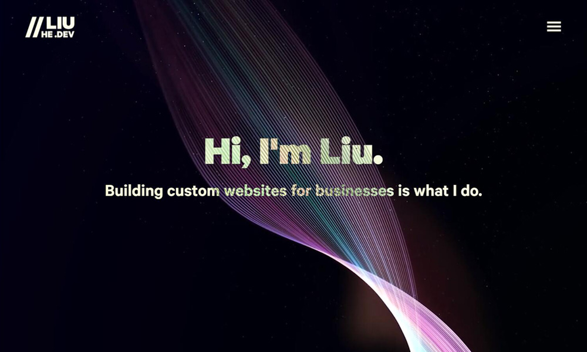

# Liu He Portfolio

This is Liu He's portfolio website showcasing his work as a web developer.

Live site: [https://liuhe.dev](https://liuhe.dev)

## Stack

## Key Features

- Slick page transitions using Framer Motion
- React Hook Form to validate contact form client side, with Google Recaptcha Enterprise for spam protection
